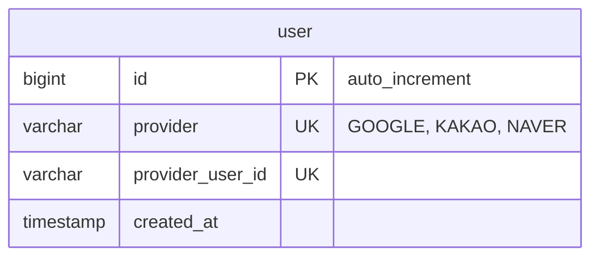

# Jipsee ERD

## user

```mermaid
erDiagram
    user {
        bigint id PK "auto_increment"
        varchar provider UK "GOOGLE, KAKAO, NAVER"
        varchar provider_user_id UK
        timestamp created_at
    }
```

- UNIQUE(provider, provider_user_id): 로그인 수단별 별도 계정
- 탈퇴: 행 삭제(하드 삭제)
